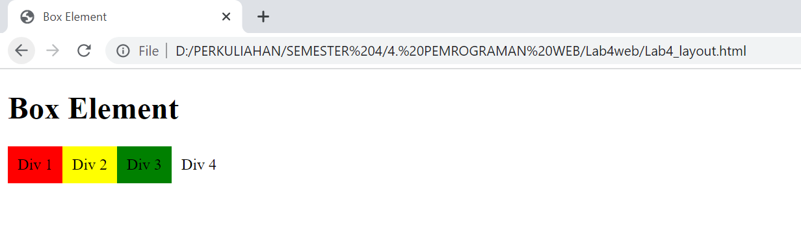
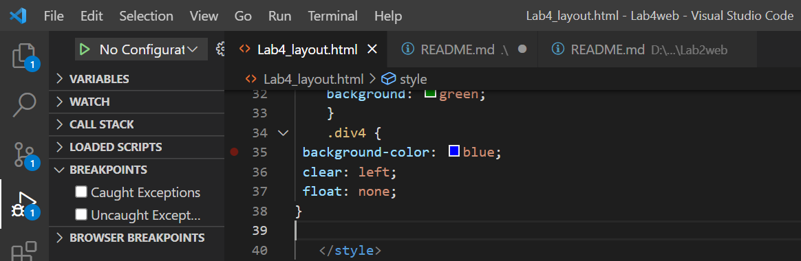

# Lab4web

## TUGAS PEMROGRAMAN WEB PERTEMUAN KE-5

Nama    : Rudi Hartono

NIM     : 312010027

Kelas   : TI.20.B1

*Pada pertemuan ke-5 ini saya akan melakukan pembuatan Css Layout pada HTML*

*PRAKTIKUM*

Langkah pertama yakni membuat dokuman dengan contoh seperti berikut:

**1. Membuat Box Element**

pada point ini kita akan menambahkan Box Element dengan menggunakan Tag < div > seperti berikut ini.

maka hasil nya akan seperti gambar di bawah ini:

Selanjutnya tambahkan deklarasi CSS pada head untuk membuat float element, seperti contoh gambar berikut

lalu pada web hasil nya akan seperti pada gambar berikut ini:

**Mengatur Clearfix Element**

**Clearfix** digunakan untuk mengatur element setelah float element. Property clear digunakan untuk mengaturnya. Tambahkan element div lainnya setelah div3 seperti berikut.

Kemudian atur property clear pada CSS, seperti berikut ini:

